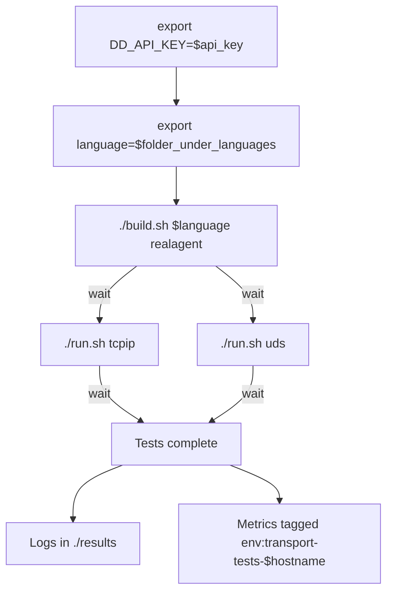
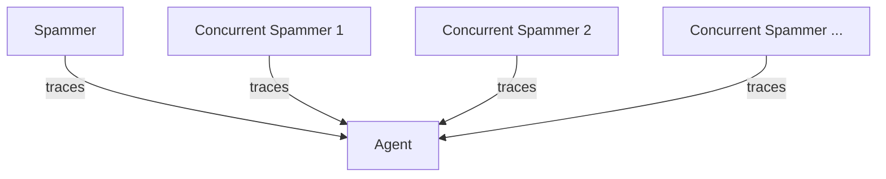
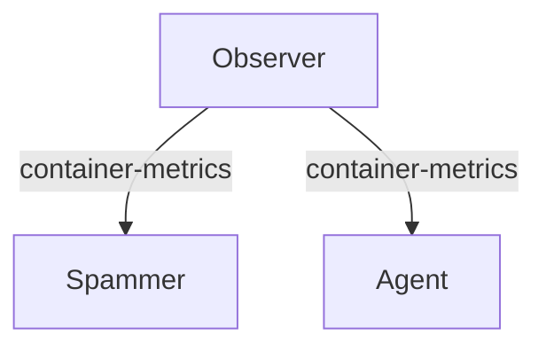
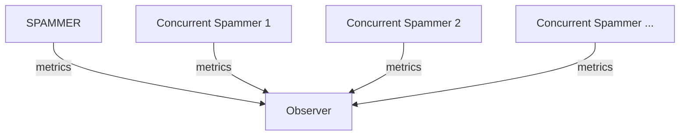

# APM Transport Stress Tests

Stress and chaos testing the tracer transports.

Refer to https://github.com/DataDog/apm-transport-stress-tests/blob/main/example-use.sh for the latest way to run this in your CI or as a job external to this repository.

## Basic usage

There are options available to customize the runs:
 - export CONCURRENT_SPAMMERS=$number_of_extra_spammer_samples_to_run
 - export TRANSPORT_STRESS_TIMEOUT_MS=$approximate_milliseconds_to_run_samples_for

## Architecture

To explain the architecture in a readable way, the charts are split into several focus areas.

This tool is designed to emulate APM load against a shared agent in a k8s cluster, without the additional noise of web frameworks and automatic instrumentation.
The purpose of this tool is to smoke test the overhead of the UDS transport against the TCPIP transport in highly concurrent scenarios.

The first goal is to not negatively affect the application on UDS compared to the well taken path of TCPIP.
The secondary goal is to understand potential span/data loss per language and transport.

The worst result would be application crashing behavior. 
We guard against this by watching for any non-graceful exits and failing the `./run.sh` script if they are detected.
If there is a graceful exit, we can expect that the metrics reported are reliable.

### Spammers and the Agent

Each language has a `spammer` application defined in the corresponding language folder (`./languages`).

The spammer application is ultimately a script that runs until `SIGINT` is received.
Approximately every millisecond, a trace is created with that tracer's manual instrumentation API.
The tracer is configured with the variables needed to enable either UDS or TCPIP depending on the ./run.sh parameters.

There is a single `spammer` container which is measured and the logs are saved to a shared volume.
There are many `concurrent-spammer` containers which are responsible for generating load for that language against the Agent.

Both the `spammer` and `concurrent-spammer` use the same image defined by the language's Dockerfile.

The numbers of `concurrent-spammer` applications can be increased until the socket the agent is listening on is overloaded.

# Observer and Container Metrics

The `observer` is standalone as it's only responsibility is to collect information about the test runs, and it is not the target of attempted overload. 
The `observer` image is ultimately the datadog agent, and collects container metrics from the `spammer` and `agent` for comparison across languages, transports, and concurrency profiles.
The `observer` is also the destination for any custom metrics from the `spammer` applications.

# Spammers and Custom Metrics

The `spammer` image is the source of truth for how many spans are created.
In order to understand throughput of spans, the spammer image self reports spans created to the `observer` container.
This allows us to compare the number of spans sent to the number of spans received for each language to understand how transport type (UDS/TCPIP) and concurrency level contribute to data loss.
Obviously, the first priority is to not negatively affect applications if communication problems occur, but this gives us data on the secondary goal of preventing or limiting data loss.

This requires that each language's `spammer` application submit metrics in a reliable and consistent way.

